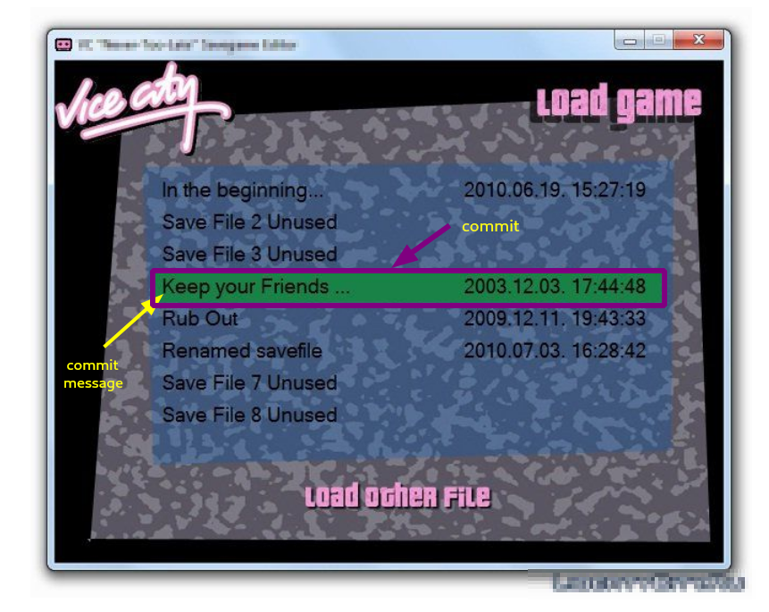
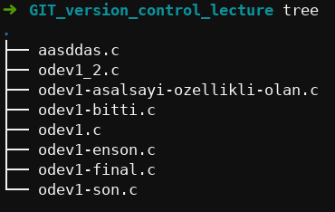
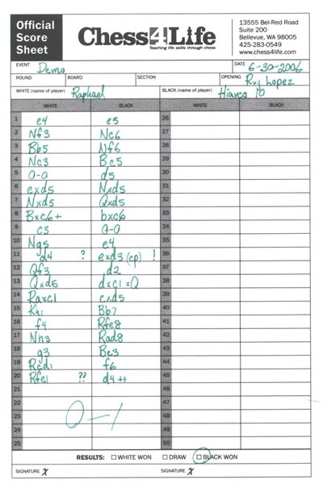
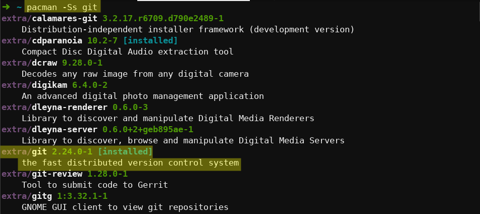
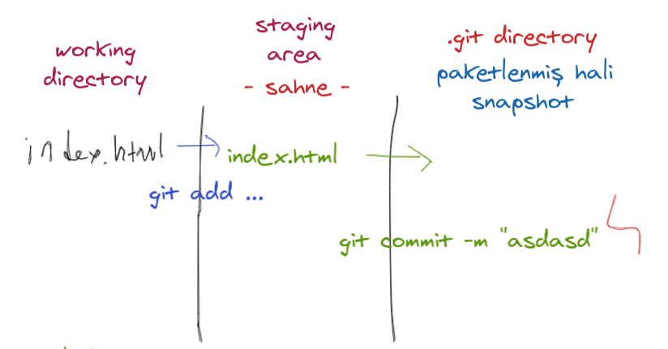
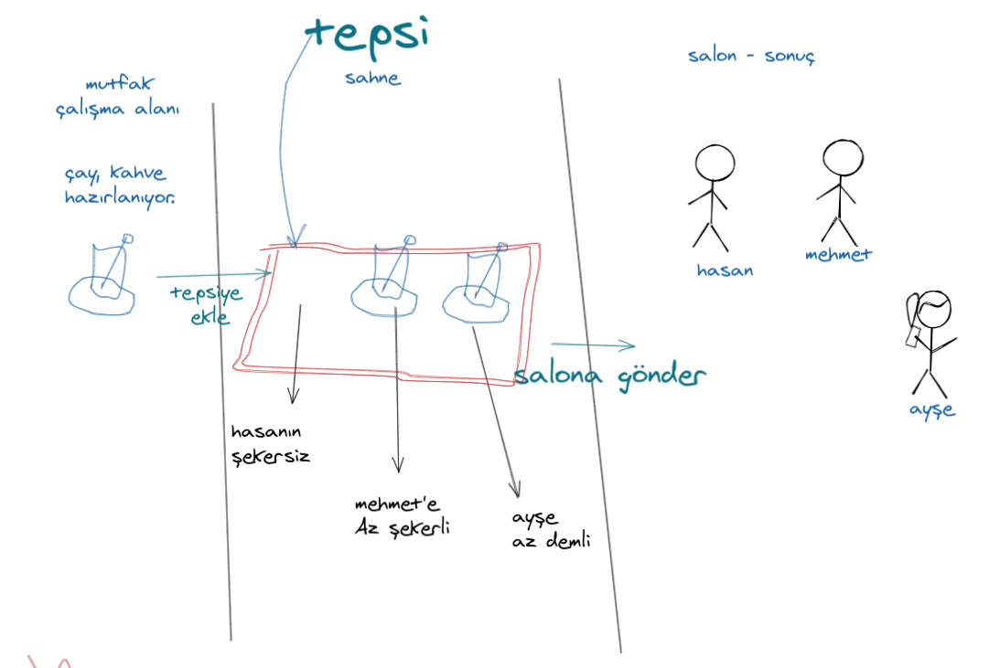
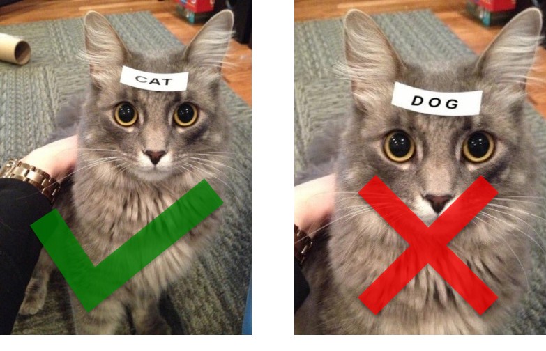
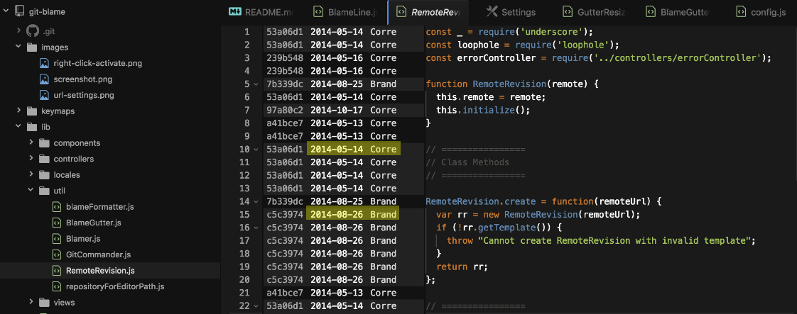
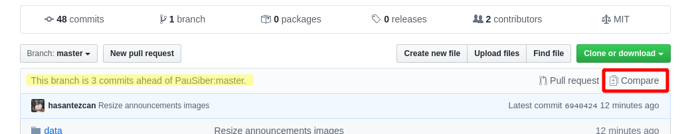
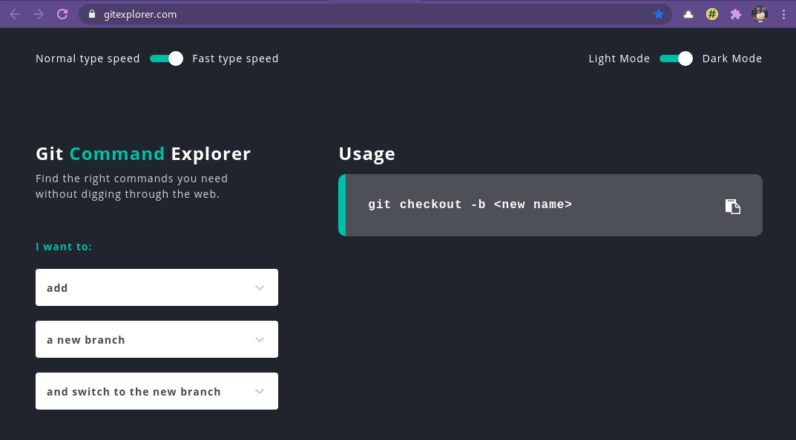

Hoşgeldin bugün versiyon kontrol sistemleri hakkında konuşacağız? Ama önce sana şunu sormak istiyorum;
## Daha önce hiç versiyon kontrol sistemi kullandın mı? 
Bugüne kadar hiç bir versiyon kontrol sistemini kullanmadığınızı düşünüyor olabilirsiniz. GIT, GitHub senin için çok yeni kavramlar olabilir! Ama size bu kavramların aslında hiç de öyle gözüktüğü gibi yabancı olan şeyler değil üstelik hayatın olağan akışında denk düşütüğünüz ve üstüne üstlük pratik de ettiğiniz kavramlar olduğunu sizlere izah edeceğim. 

Öyleyse haydi başlayalım. 

## Hayatımızda farkında olmadan versiyon kontrol'ü yaptığımız noktalar!

Hayatın olağan akışında kişiler yazılımcı olsun olmasın muhakkak versiyon kontrolleme ile meşgul oluyorlar. Bu tecrübe ilk başlarda bilinçizce ya da bir başka değişle farkında olmadan cereyan ediyor.

### 1- Oyunlardaki `SAVE/LOAD` sistemleri

Oyunlarda yaptığınız save işlemi aslında bir versiyon kontrol işlemidir. Karakterinizin o anki halini kaydeder olası bir durumda kaydettiğiniz yerden devam edersiniz. Bu kayıtlar için bir isim belirleyebilirsiniz. Ve o karakterin birçok durmunu bu save'lerde saklayabilirsiniz.

`GTA Vice City`, `Max Payne` gibi hikaye bazlı oyunlarda bu kullanımı sıkca görürüz. 

<p align="center">
	
</p>

### 2- Dijital ödevler

Okuldan verilen (dijital ortamda) herhangi bir ödevi (projeyi) yaparken **`böyle bir tablo` ile muhakkak karşılaşmışsınızdır**.

<p align="center">
	
</p>

Projeniz üzerinde yapılan değişikleri bir şekilde saklamak için bu görselde olduğu gibi ***farkına varmadan*** **`kendi versiyon kontrol sistemini geliştirirsiniz!`** ve bunu bir fiil kullanırsınız.

Bu versiyon kontrol sistemi tamemen hayatta kalam dürtileri ile ortaya çıkmış bir yöntemdir. **Ödevinizin çalışan en iyi halini kaybetmeyi asla istemezsiniz.** Ve öyledir ki bu gibi durumlarda karşı karşıya kalan bir çok kişi buna benzer bir yolu kendi kendine keşfederler. Bu akla gelen en ilkel versiyon kontrollemedir. 

Bu ilkel yönetemin, çıkan dosya kaosundan sebep ölçeklendirileblir olmadığı ortadadır ve bu sebeple **`iyi düşünülmiş bir versiyon kontrol sistemine ihtiyaç duyarız!`**

Bugün sizlerle birlikte yazılım alanı için var olan versiyon kontrol sitemlerinden ve günümüzde yaygın olarak kullanılan GIT version kontol sisteminin nasıl kullanıldığından bahsedeceğim.

## Versiyon Kontrol Sistemi Nedir?

Versiyon kontol sistemleri herhangi bir proje üzerine çalışırken size yaptığınız değişiklikler ve yenilikler arasında boğulmadan temiz bir şekilde çalışabilme imkanı sunar.

Version kontol sistemleri ile çalışamayı öğrendikten sonra bir proje üzerinde **zamanda geri gidebilir** projenizin falanca zamanki halini o günkü hali ile inceleyebilir ya da projenizin o anki halini bozmadan üzerine yeni denemeler yapabilir ve bu denemeniz istediğiniz gibi olursa ana projenize bu özelliği ekleyebilirsiniz.

Bu söylediklerimi en başta gördüğümüz insan beyninin direk oluşturduğu versiyon kontrol sistemi ile yapmaya kalkmak bi yerde mantıklı olsa da bu yöntemle devam etmek bir yerden sonra **sizi sinir krizlerine sokabilir** **`hata ve hata projeninizi geliştirecem derken çalışır halinden de olmanıza sebep olablir.`**

Gelin şimdi var olan versiyon sistemlerne bir göz atalım.

- **CVS** : 1986, Versiyon kontrol sistemlerinin dedesidir.

- [**SVN**](http://subversion.tigris.org/) : Bu proje şu an kitli durumdadır.

- **`Git`** : üzerine detaylıca konuşacağımız versiyon kontrol sistemi.

- **Mercurial**

- **Bazaar**

- **Monotone**

> [**[0]**](https://www.smashingmagazine.com/2008/09/the-top-7-open-source-version-control-systems/),
> [**[1]**](https://www.g2.com/categories/version-control-systems?trending=)

Bu versiyon kontol sistemlerinden kimileri hala aktif; kimileri de şu an kulladığımız versiyon kontrol sistemlerine zamanında ilham olmuş fakat şu an ömürlerini doldurmuş durumdadırlar.

Bugün biz günümüzde en yaygın kullanılan versiyon kontrol sistemi GIT ile çalışacağız ve projelerimizi git ile yönetmeyi öğreceğiz.

## Git Nedir?

[**Git**](https://git-scm.com/) özgür ve dağıtık bir version kontrol sistemidir. GIT, linux'ü geliştiren ekibin o zamanlar kullandıkları [**BitKeeper**](https://www.bitkeeper.org/) adlı proje yönetim araçının ücretsiz lisans anlaşmasının bitmesi ile Linus Toravalds ve ekibinin BitKeeper'ı kullanırken yaşadıkları sıkıntıları da göz ederek tasarladıkları 2005 yılında ortaya çıkan bir versiyon kontrol sistemidir.

Git ismi, [Linus Torvalds tarfından](https://git-scm.com/book/en/v2/Getting-Started-A-Short-History-of-Git#:~:text=and%20in%20particular%20Linus%20Torvalds,%20the%20creator%20of%20Linux) Git'in ilk versiyonunun yayımlanması ile verilmişitir. Aslında Git kelimesi İngiliz  ingilicesinde **"aptal"** anlamına gelen argo bir kelime. [**[2]**](https://dictionary.cambridge.org/dictionary/english/git)

**bakınız:** [A Short History of Git](https://git-scm.com/book/en/v2/Getting-Started-A-Short-History-of-Git)

<p align="center">
	
</p>

Ayrıca Linus Torvalds "**GIT**" isminin açılımını şu şekilde ifade ediyor;
- Düzgün çalışıp iş gördüğünde ve sizi mutlu ettiğinde **Global Information Tracker** (Küresel bilgi takip sistemi)
- İstediğiniz gibi çalışmazsa ve sizi çıldırtırsa da **"Goddamn Idiotic Truckload of shit"**

## Neden `Versiyon Kontrol Araçları` kullanırız?

Genel olarak bir şeyler üretirken **hızlı hızlı** ilerleme yolunu seçiyoruz. Yazılım geliştiriken de verilen bir ödevi **hızlıca bitirip teslim etmek** çok daha kolayımıza gelebiliyor.

<p align="center">
	
</p>

Ödevlerin kapsamı küçük olduğu zaman bu yaklaşım gerçekten pratik bir çözüm olabiliyor. Fakat işler büyüdüğünde yani **`profesyonelleştiğinde`** hızlı hızlı hareket etmek zorlaşıyor ve **hata payınız git gide büyüyor.**

Böyle büyük çaplı işlerde ya da finansal sorumluluğunuz olan projelerde hata yapma şansınız çok daha az oluyor.

İşte tam bu durumu idare etmek ve yönetmek için **versiyon kontrol** kulanmak kaçınılmaz oluyor. 

Başta angarya gibi gelen **bu süreçin;** bir hata ile karşı karşıya kaldığında ve versiyon kontorlü yaptığınız için bu hataya hızlıca çözüm getirebildiğinizi gördüğünüzde **hiç de angaryadan olmadığını anlıyorsunuz.**

<p align="center">
	
</p>

**Satranç oyunu** bu durumu anlamak ve açıklamak için çok güzel bir benzetme.

Eğer bir satranç musabakası izlediyseniz oyuncuların her hamleden sonra tahtanın yanı başındaki bir kağada bir şeyler yazdıklarını görmüşsünüzdur. 

<p align="center">
	
</p>

Satranç oyuncuları bu kağıtlara oyun esnasında yapılan hamleleri not etmektedirler. İki oyuncu da bu hamleleri kaydeder. Maç sonunda bu kaydedilen hamleler sayesinde o maç baştan sona incelenebilir hale gelir. Yani o maçı her versiyonu ile iki oyuncu kayıt altına almış olur.

<p align="center">
  
  <br>
	<em>Chess score sheet example <a href="https://blog.chesshouse.com/how-to-read-and-write-algebraic-chess-notation/">- source</a> </em>
</p>

Öteyandan arkadaşlar arasında keyfine yapılan hızlı maçlar esnasında. Bu işlemi yapmak sizlere büyük bir angarya olarak gelebilir. İşte burada karar mekanizması yaptığınız projenin-işin **sizin için ne kadar önemli-değerli-kaybedilemez olduğudur.** 

Kısa süreli ve ileriye dönük bir beklenetiniz olmadığı durumlarda kullanmak gereksiz olabilir. Fakat genel olarak bunun dışındaki tüm durumlarda kulanmakta fayda vardır! :)


## Git Nasıl kullanılır?
> **Git'in Temelleri**

Öncelikle git versiyon kontrol sistemi yazılımının **bilgisayarınızda yüklü olması** gerekiyor.

Bu yazılımın bilgisayarınızda var olup olmadığını öğrenmek için GNU/Linux bir işletim sistemi kullanıyorsanız paket yöneticiniz ile git programnı aratıp bilgisayarınıza yüklü olup olmadığını öğrenebilirsiniz.

<p align="center">
	
</p>

Eğer GNU/Linux dışında bir işletim sistemi kullanıyorsanız kurulum aşamalarınıa [**git'in resmi sitesinden**](https://git-scm.com/downloads) bakabilirsiniz.

---

### `git init`

Projemizi versiyonlamak için önce proje dizinimize girip ardından da `git init` komutunu yürütmemiz yeterli.

```bash
$ git init
Initialized empty Git repository in /projenin_adresi
```
Komutu yürüttükten sonra projemiz içinde hiç bir şey değişmemiş gibi görünüyor fakat öyle değil.

```bash
$ ls -a
.  ..  .git
```

Git yazılımını projemizden başlatıktan sonra projemiz içine gizli halde gelen **`.git` dizinini** görmekteyiz. Bu dizin içinde versiyonlamaya dair tüm dosyalar tutuluyor.

> Bu dosyanın silinmesi halinde tüm versiyonlama işlemlermiz yok olacakıtır.

> **`!!!`** Hatalı bir `git init` çalıştırılması durumunda `.git` dizinini silmek **versiyon kontrolünü dizninizden kaldıracaktır.**

---

<p align="center">
	
</p>

## **`Commit`** Nedir ve Nasıl Çalışır?
GIT aslında bir takip aracıdır. Sizin yaptığınız tüm hamleleri izler. Aynı demin bahsi geçen satranç maçlarında oyuncuların maçları takip ettikileri gibi.

Tabi GIT'in bu takibi yapabilmesi için onu doğru şekilde yönlendrimemiz gerekiyor şimdi bunu nasıl sağlarız onu öğreneceğiz.

Öncelikle değişikliklerin yaşam döngüsünü anlamamız gerekir.

## Değişikliklerin yaşam döngüsü!

<p align="center">
	
</p>

Üç aşamalı bu yaşam döngüsünün başlangıçı `working directory`'dir. Bu çalışıyor olduğumuz dizini ifade eder. **Bunu vsCode'da çalışırken çalıştığımız dosyalar olarak da düşünebiliriz.** Git comutlarını yürüttüğünüz dizin `working directory` olarak kabul edilir. Bir alt dizine gidip orada işlem yaparsanız `working directory`'yi o dizin olacak şekilde kabul etmiş olursunuz.

Bir sonraki aşama ise `staging area`'dır. Bu yanlızca bir ara aşamadır. `Working directory`'de yaptığınız değişikliklerden versiyonlamak istediklerinizi seçer ve bu aşamaya gönderirsiniz. Yapılan bu değişiklerini bu aşamaya göndermek için; 

```bash
git add dosya-adı
``` 

gibi bir söz dizimi kullanılır. Bu sayede sadece o dosya içindeki değişiklikler staging areaya taşınacaktır. Eğer birden fazla dosyayı birden bu alana taşımak isterseniz o zaman 

```bash
git add .
```

demeniz yeterli olacaktır. Bu komut o dizin içine yapılan tüm değişikleri staging areaaya taşıyacaktır!

Bundan sonraki aşama ise `.git directory`'dir. Burada yapılan değişikler kaydedir ve paketlenir. Bu paketlenmiş snaphot'lara `commit` adı verilir ve bu commit'lerin oluşma serüvenindeki son adımdır. 

Staging'e (Saheye) çıkarılmış değişikleri versiyonlamak için (commitlemek için) kullanmamız gereken komut ise 

```bash
git commit -m "Commit mesaji"
```
Bu noktadan sonra değişikliklerimiz kayıt edilmiş olacaktır.

..  
..  
..  


> Bu durumu bir analoji ile ifade etmek istersek...
## Çay Tepsisi Anolojisi

Bazen commit'lerin oluşum öyküsü biraz soyutca kalabiliyor. Bu sebeple çay tepsisi benzetmesi ile kafalarda biraz daha yer etmesini sağlamamız mümkün olabiliyor.

<p align="center">
	
</p>

Mutfağı bir çalışma alanı gibi düşünebiliriz burada çay, kahve hazırlanıp salondaki kişilere içmesi için göndermek isteniyor gibi varsayabiliriz. 

Bu durumda bize geçici bir konak lazım olacaktır ki buna tepsi diyebiliriz. Hazırlanan çay kahveler salonda bunları kim içecek diye isimlendirilerek içilmek üzere salona gönderiliyor. 

Bunu bir commitin oluşma aşamaları gibi somutlayabiliriz.

..  
..  
..  

### `git status`

Git status ile projedeki değişikliklerin anlık durumlarını kontrol ederiz. Herhangi bir adımı uygulamadan önce durum bilgisini görmek bizi daha az hataya sevk edecektir.

### `git add`

> Commit döngüsünde üzerinde durmuş olsak da üzerinden bir defa daha geçebiliriz.

iki tür dosya durumu vardır bunlar **tracked** ve **untracked**

Dosyaları staging area'ya almak için - stage

```bash
$ git add <dosya_adı>
```


stagin areaden çıkarmak için - unstage
```bash
$ git rm --cached <dosya_adı>
```

bu olaylar direk .git dosyalarına yansır bunu göremek için

ayrı bir terminalde şu komutu çalıştırsanız değişiklerikeri takip edebilrsiniz.

```bash
$ watch -n .5 tree .git
```

3 adet git objesi vardır bunlar;
- **blob** - collect of date - row data - descreption about the data
- **tree** - ...
- **commit** - en of the snapshot versionesed one

[**[3]**](https://git-scm.com/book/en/v2/Git-Internals-Git-Objects)

> Bu konuya ilerleyen zamanlarda daha da detaylıca değiniyor olcağım!

### `git commit`

> a new snapshot
> 
Bir commit geri gider yani HEAD kafasını bir önceki commitin kine eş hale getirir. Son durumdan kalan değişikler untracked hale gelir.
```bash
git reset HEAD~
```

<p align="center">
	
</p>

### Commit mesajı oluşturuken dikkat edilmesi gereken noktalar.


### `git log`


---

## Branchlar ile çalışmak

## `git brach`

bütün brachları listeler

```bash
git branch
```

brach oluşturmak

```bash
git checkout -b <branch_adi>
```

local brach silmek

```bash
git branch -d <branch_adi>
```

brachdaki güncellemeleri uzak depoya yollar
```bash
git push origin <branchname>
```
## `git stash`

```bash
git stash

git stash pop
```

## .gitignore dosyası

https://careerkarma.com/blog/gitignore/


---

### `git config`

Versiyonlamaya başlamadan önce yazacağımız kodların kimin tarafından yazılıdığının bilinmesi açısından GIT ayarlarımızı yapmamız gerekiyor.

hali hazırdaki git ayarlarını  görmek için

```bash
$ git config --list
```
Henüz bir ayar girmemişseniz boş bir çıktı alacaksınız. Ayarlamak için;

```bash
$ git config --global user.name "kullanıcı_adınız"
$ git config --global user.email "mail_adresiniz"
```

Şimdi projemizi versiyonlamak için hazırız.

## Annotation

**Annotation** denen bir kavramdan bahsetmek istiyorum. Türkçe dipnot demek olan bu kavram yazılan kod satırlarının kim tarafından yazıldığını ifade eder. Demin girdiğimiz git config'leri (ayarları) bu annotation'larda gözükür. Bu kullandığınız ide ya da metin editorlerinde ya kendiliğinden gelecektir ya da eklenti şekilde kurulabilir.  

<p align="center">
	
</p>

Annotation'lar sayasinde bir projede çalışırken okduğunuz kodun **kim tarafından ne zaman yazıldığını görebilirsiniz.** Ve dilediğiniz zaman bu kod parçacıkları için kodun sahibi ile belirttiği e-posta adresi ile ileteşime geçebilirsiniz.

Yani annotation'lar bir nevi imza görevi görür.  

**bakınız:** [vsCode için git lens](https://marketplace.visualstudio.com/items?itemName=eamodio.gitlens) eklentisi

---

# `Özel sorunlar ve çözümleri`

## Repo transfer etmek

Bunun için iki yol mevcut;
biri tüm commitlerinizi de saklayıp trasnfer etmek, diğeri de hiç bir commitinizi saklamadan trasfer etmek.

İkinci yol en basit olan hadi onla başlayalım.

### Bir git reposunu commit geçmişSİZ yeni bir repoya taşıma

Repolarımızda git ile ilgli tüm dosyalar `.git` adlı bir dizinde tutulur. Config dosyalarımız, commit geçmişimiz vb. tümü bu dosya içindedir.

Bizim commitlerimizi saklama gibi bir derdimiz yoksa bu dosyayı silmemiz gerekir ki tüm commitlerden arınalım ve yeni bir başlangıç yapalım.

GNU/Linux sistemlerde gizli dosyaları görmek için `ctrl + h` kısa yolunu kullanabilirsiniz.

```bash
rm -rf .git
```

dedikten sonra repo içindeki tüm dosyaları yeni reponuza yapıştırıp ilk commitinizi atabilirsiniz.

```
git add .
git commit -m "Initial commit"
```


### Bir git reposunu commit geçmişi ile beraber yeni bir repoya taşıma

> Git reponuzu commit geçmişi brachları ve tag'ları ile beraber yeni bir repoya yüklemek.

Hadi bu durmu simule edelim elinizde bir repo var ve bu repoyu bambaşka yeni bir repoya taşımak istiyorsunuz. Tüm commitler ile beraber. Taşıyacağınız repo bir başka kişinin reposu olabilir ya da bir organizasyon reposu olabilir. Bu hiç bir şeyi değiştirmez. Peki nasıl yaparız?

`1-` **İlk olarak transfer edeceğiniz repoyu belirleyin. Belli bir reponuz yoksa yeni bir repo oluşturun.**


`2-` **Sonrasında eski reponun bir mirror reposunu yaratarak başlayacağız.**

```bash
git clone --mirror old-repo-url new-repo-name
```

> `old-repo-url` yazan kısma taşımak istediğiniz reponun url'ini yazın. ve `new-repo-name` yazan yere de trasfer edeceğiniz reponun adını yazın.


`3-` **Repoya girin ve eski(orjinal) reponun remote referans bilgisini temizleyin.**

```bash
cd new-repo-name
```

Remote referans bilgisini sildiğinizi bu çalıştırılabilir ile kontrol edebilirsiniz.
> (Q ya basarak çıkabilirsiniz.)

```bash
git config --list
```

```bash
git remote remove origin
```
Bu çalıştırılabiliri çalıştırdıkran sonra remote bilgisinin artık olmadığını göreceksiniz.


`4-` **Yeni reponunuzun remote bilgisini ekleme**

Github, gitlab ya da bitbucket uzak reponuz neredeyse uzak reponuzun remote linkini local reponuza bu şekilde ekleyin;

```bash
git remote add origin new-repo-url
```
> `new-repo-url` yerine uzak reponuzun(remote) URL'ini girin.	 

`5-` **Yapılan tüm düzenlemeleri uzak repoya yollayın**

```bash
git push --all
git push --tags
```

`6-` **Uzak deponuzu clone'layın ve üzerinde çalıştığınız repoyu silin**

Bir üst dizine çıkıp üzerinizde çalıştığınız repoyu silin. Bu adımı bu repo üzerinde bu hali ile çalışamadığımız için gerçekleştiriyoruz. Bu haliyle içinde git dosyaları açık şekilde çalışıyor. Ve bu istemediğimiz bir şey.

```bash
cd ..
rm -rf new-repo-name
```

Sonrasında uzak repomuzdan(remote) bilgisayarımıza(local) tekar indiriyoruz.

```bash
git clone new-repo-url
```
> `new-repo-url` yerine uzak reponuzun(remote) URL'ini girin.


Bu aşamadan sonra reponuzu commitleri ile birlikte yeni reponuza transfer taşımış bulunuyorsunuz.

---

## Fork edilmis bir repoyu ana repo ile senkron etmek!

Aidiyetligi sizde olmayan bir repoya pull request attınız ve pull requestiniz merge oldu. Üzerine başka değişiklikler yapıldı ya da yapılmadı. Zaten merge olduktan sonra sizin reponuz bir commit geri kalıyor. Ve onu senkron etmeniz gerekiyor.

Bunu nasıl yaparız?

<!-- Github kullanıyorsanız arayüzden "Compare" tuşununa basıp bu işlemi gerçekleştirmeniz mümkün.

<p align="center">
	
</p> -->

Komut satırı üzerinden nasıl yapılacağına bakalım.


```bash
$ git remote add upstream <original-repo-url>
```

```bash
$ git fetch upstream   # update local with upstream
```

```bash
$ git diff HEAD..upstream/master     # see diffs between local and upstream/master (if there is no diff then both are in sync)
```
```bash
$ git pull upstream master           # pull upstream's master into local branch
```
```bash
$ git push origin HEAD               # push to your forked repo's remote branch
```
[**[0]**](https://stackoverflow.com/questions/41542640/how-to-synchronize-fork-with-original-github-project)


..   
..  
..  
..   
..  
..  
..   
..  
..  
..   
..  
..  
..   
..  
..  
..   
..  
..  

## `Faydalı Kaynaklar:`

- **https://gitexplorer.com/** ile GIT versiyon kontrolleme komutlarını tanıyabilir ve ihtiyacınız olanı komutu bulma noktasında bu araçtan faydalanabilirsiniz.  
	<p align="center">
	
</p>

- **Pro Git Kitabı** git'in resmi sitesinde ana kaynak olarak göstirmektedir. Belli kısımlarının Türkçe çevirisi de yapılmış durumdadır. http://git-scm.com/book/en/v2

	> Eğer bu çevirinin tamamlanmasına katkı sağlamak isterseniz https://github.com/progit/progit2-tr/issues 

- https://gitimmersion.com/
- http://gitready.com/
- https://learngitbranching.js.org/
- http://vigo.github.io/git-tips/
- https://aliozgur.gitbooks.io/git101/content/alistirmalar/
- https://enterprise.github.com/resources
- https://mesuutt.com/2013/07/git-ipuclari/
- https://github.com/arslanbilal/git-cheat-sheet/blob/master/other-sheets/git-cheat-sheet-tr.md

- [7 rules of a great git commit message](https://chris.beams.io/posts/git-commit/#:~:text=The%20seven%20rules%20of%20a%20great%20Git%20commit%20message)
- [Basic git commands](https://confluence.atlassian.com/bitbucketserver/basic-git-commands-776639767.html)
- [Atlassian git source](https://www.atlassian.com/git)

## Cheat Sheets
- https://gitsheet.wtf/
- [Temel terminal komutlarına yabancıysanız bu tablodan faydalanabilirsiniz.](https://www.git-tower.com/learn/cheat-sheets/cli/) 
- [Git Cheat Sheet by Tobias Günther](https://www.git-tower.com/blog/posts/git-cheat-sheet)
- [The Workflow of Version Control](https://www.git-tower.com/learn/cheat-sheets/vcs-workflow/)
