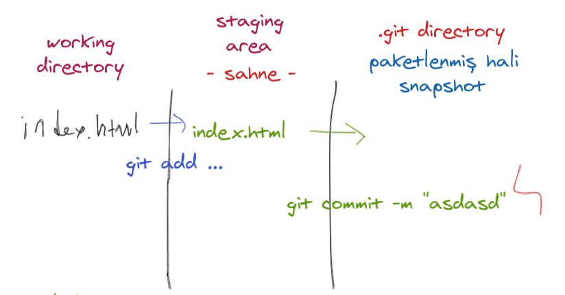
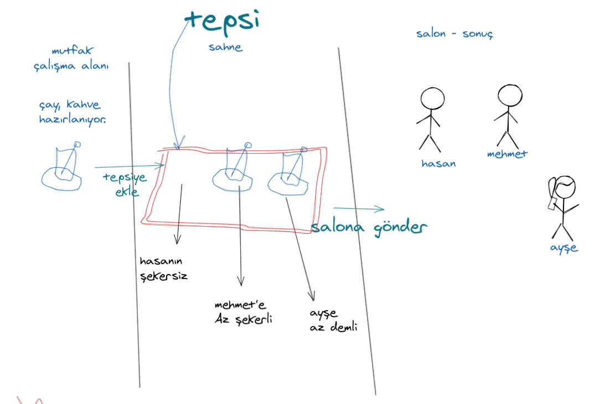

- Hoş geldiniz 

- **Konumuz**: Versiyon Kontrol Sistemleri
  - Hayatımda **hiç** versiyon kontrol sistemi **kullanmadım** diyen var mı?
  - Hayatımızda **farkında olmadan** versiyon kontrol'ü yaptığımız noktalar
    - Okuldan verilen ödevler; 
      - > `Kendi versiyon kontol sistemimiz.`
      - Performans ödevleri
      - Projeler
    - **GTA VICE CITY** save'leri 
      - > Ya da herhangi bir oyun!
      - Burada da farkında olmadan birileri tarafından yapılmış bir versiyon kontrol sistemini kullanıyordunuz.
      - Save ediyor - SAVE ederken ona bir isim veriyor.
      - Sonrasında o save'i load edip oyuna devam ediyordunuz. 
  - Gördüğünüz gibi aslında herkes versiyon kontrol sistemleri ile çalışmış. Fakat farkında değildiniz.

**Bugün de yazılımda versiyon kontrol nasıl yapılır ona bakacağız.** 

Yazılımda kullanılan versiyon kontrol'e bir güzel örnek de **SATRANÇ OYUNUDUR!**

- Resmi satranç maçlarında oyuncular. Yaptıkları her hamleyi karşılıklı şekilde her hamleden sonra not alırlar burada amaç oyunun adım adım kayıt etmektir. Masada gerçekleşen değişikleri itina ile kaydederler olası bir aksilikte bu kayıtlar kıyaslanarak oyun tekrar oynanabilir. 

- Ama öteyandan arkadaş arasında hızlı oynanan maçlarda bu versiyon sistemini kullanmazlar. Bunu kullanmadaki amacımız o işi sonrasında ne kadar önem verdiğimizdir. Sonraki durumlarda ne kadar dikkate alacağımızdır. 
  - Bazı noktalarda kişiler **pratikce** halledeceklerinde bu sistemleri kullanmayı **angarya** sayarlar.

---

## Uygulama - `Commit mantığı`

- Projeye başlamak 
  - **`git init`**
  - README'yi hazırla.
    - Başlık **Katılımcılar**.
    - İkinci dosya ise **kaynaklar** ya da **notlar**.
  - COMMIT ŞEMASI
    - 
    - COMMİT ANOLOJİSİ (BENZETMESI)
    - 
  - **git status**
  - **git add README.md**
  - **git status** 
  - ASLINDA GIT SIZI otomatik olarak takip eder! ayni satrançın da olduğu gibi.
    - **track**, **untrack** meselesi 
  - **git commit -m "README.md'yi oluşturur."**
  - **git log** log: sirali kayit

- GİT COMMİT BEST PRACTİES 
  - https://www.perforce.com/blog/vcs/git-best-practices-git-commit#:~:text=Write%20Short,%20Detailed%20Commit%20Messages
  - [COMMIT MESAJLARI İÇİN 7 ALTIN KURAL](https://chris.beams.io/posts/git-commit/#:~:text=The%20seven%20rules%20of%20a%20great%20Git%20commit%20message)

  - Katılımcılardan birileri ekle bir tur!
  - VSCODE ARAYÜZÜ ile bunu yap!
  

  - Commit **mesajını değiştrimek** istersen 
  - `git rebase -i HEAD~3`
  - reword yaz ve mesaji değiştir.  
  - *******

  - `git commit --amed --no-edit` yapılan değişiklikleri direk son comit'e yazar!
  - > https://www.youtube.com/watch?v=ElRzTuYln0M

> rebase ettiğinizde merge commit olmadan devam ediyorsunuz 
> https://jeffkreeftmeijer.com/git-rebase/git-rebase.png
---

## Working with Branches

- Branch Nedir? 
  - Ağaç **Dal**ı, **kol**, **şube** gibi manalara gelir. 
- Nasıl branch oluşturulur?
  - `git branch branch-adı`

ÖRNEK BRANCH ADI `feature/header`
  branch'ın adını niye böyle oluşturdum **GIT FLOW**
  - https://www.atlassian.com/git/tutorials/comparing-workflows/gitflow-workflow
  - kursun adini tepeye ekle
  - ```markdown 
    ## GIT for total beginners Workshop
    ```
- Var olan tüm branch'ları görmek için
  - `git branch -a`  
- O branch'e gitmek için  **`CHECKOUT`** **ayrilmak**, **yer değiştirmek** gibi ya da **teslim almak** gibi manaları var! 
  - `git checkout branch-adı`
  - > https://www.atlassian.com/git/tutorials/using-branches/git-checkout

  - Branch oluşturup direkt içine gitmek için! 
    - `git checkout -b branch-adı`

### git merge
> https://www.atlassian.com/git/tutorials/using-branches/git-merge

yeni bracnh'da yapacaklarını yap 

sonra master'a geç 

```bash
git checkout master
git merge new-feature
```

alternative rebase 

## Bir commit'e geri dönelim ve oradan bir branch açalım!
git switch 

## Github tanıtımı
* .gitignore nedir
  * hemen bir deneme yap! 
* LİCENSE
  * Yazılım lisansları
    * https://hasantezcan.dev/blog/ozgur-yaz%C4%B1l%C4%B1m-felsefesi-ve-temel-kavramlar.html#:~:text=Yazılım%20lisansları:
* README.md

## REMOTE REPO EKLE
- tüm remote'ları göster!  
  - `git remote -v` 

- tüm config'i göster 
  - `git config --list`

- remote ekle
  - `git remote add origin git@github.com:hasantezcan/test-lala.git`

remote'a bağalama

- **git push** 

sonra bir de git pull

## PULL REQUEST VE MERGE!

- hacktober fest 

- github student pack 

# SON

- Ödev - REPOYU FORK EDİP HERKES KENDİ ADINI YAZSIN
- Hatıra fotoğrafı
- Aket
### KAYNAKLAR:

- Atalisan'ın kaynakları gerçekten çok iyi!
- https://www.atlassian.com/git/tutorials/atlassian-git-cheatsheet
- http://rogerdudler.github.io/git-guide/index.tr.html